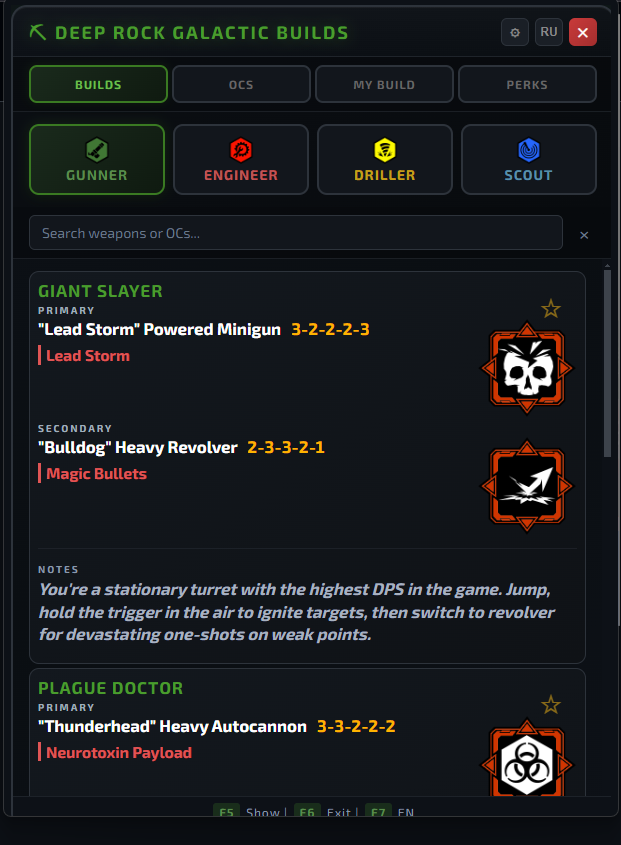

# DRG Overlay

🪨 Удобный оверлей для Deep Rock Galactic, который показывает билды оружия и классов поверх игры.



## Зачем это нужно

Вместо того чтобы сворачивать игру или искать гайды в браузере, оверлей позволяет мгновенно получить доступ к нужной информации, не прерывая игровой процесс.

## Возможности

- **Всегда поверх игры** — окно закреплено поверх всех приложений, включая полноэкранный режим.
- **База билдов** — подробные конфигурации оружия для всех четырёх классов:
  - Gunner (Пулемётчик)
  - Scout (Разведчик)
  - Driller (Бурильщик)
  - Engineer (Инженер)
- **Переключение языка** — интерфейс доступен на русском и английском (F7).
- **Перетаскивание** — окно можно переместить в любую часть экрана мышкой.
- **Клик сквозь окно** — когда оверлей неактивен, клики проходят сквозь него прямо в игру.
- **Свои настройки** — возможность изменить хоткеи под себя прямо в интерфейсе.
- **Сохранение позиции** — при следующем запуске окно откроется там же, где вы его оставили.
- **Красивый интерфейс** — тёмная тема в стиле игры с иконками и анимациями.
- **Портативность** — можно собрать в один `.exe` файл и запускать без установки Node.js.

## Хоткеи

- **F5** — показать или скрыть оверлей
- **F6** — выйти из приложения
- **F7** — переключить язык (Русский / Английский)

## Установка и запуск

1. Установите зависимости:
   ```bash
   npm install
   ```
2. Запустите:
   ```bash
   npm start
   ```

## Сборка

Чтобы создать портативную версию `.exe`:
```bash
npm run build
```
Готовый файл появится в папке `dist`.

## Лицензия

MIT License — Copyright (c) 2026 Ekcler
